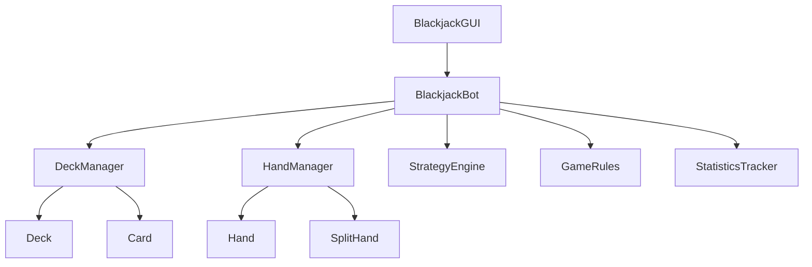

# Design Document

## Overview

This design document outlines the architecture and implementation approach for enhancing the blackjack bot with realistic deck simulation, split functionality, complete strategy tables, and configurable dealer rules. The design maintains backward compatibility while adding sophisticated features that mirror real casino blackjack.

## Architecture

### Core Components

1. **DeckManager** - Handles deck creation, shuffling, and card dealing
2. **HandManager** - Manages multiple hands including splits
3. **StrategyEngine** - Complete basic strategy with pair splitting
4. **GameRules** - Configurable dealer and game rules
5. **EnhancedGUI** - Updated interface for new features
6. **StatisticsTracker** - Advanced statistics with split tracking

### Component Relationships



## Components and Interfaces

### DeckManager Class

```python
class DeckManager:
    def __init__(self, num_decks=1):
        self.num_decks = num_decks
        self.cards = []
        self.dealt_cards = []
        self.shuffle_threshold = 10
    
    def create_deck(self) -> List[Card]
    def shuffle_deck(self) -> None
    def deal_card(self) -> Card
    def cards_remaining(self) -> int
    def needs_shuffle(self) -> bool
```

### HandManager Class

```python
class HandManager:
    def __init__(self):
        self.hands = []
        self.current_hand_index = 0
        self.split_count = 0
    
    def add_hand(self, cards: List[Card]) -> Hand
    def split_hand(self, hand_index: int) -> Tuple[Hand, Hand]
    def get_current_hand(self) -> Hand
    def next_hand(self) -> Hand
    def all_hands_complete(self) -> bool
```

### Hand Class

```python
class Hand:
    def __init__(self, cards: List[Card] = None, is_split: bool = False):
        self.cards = cards or []
        self.is_split = is_split
        self.is_split_aces = False
        self.is_complete = False
        self.bet_amount = 0
    
    def add_card(self, card: Card) -> None
    def get_value(self) -> int
    def is_soft(self) -> bool
    def is_blackjack(self) -> bool
    def can_split(self) -> bool
    def can_double(self) -> bool
```

### StrategyEngine Class

```python
class StrategyEngine:
    def __init__(self):
        self.hard_strategy = {}  # Extended to include 5-21
        self.soft_strategy = {}  # Complete A,2 through A,9
        self.split_strategy = {  # Pair splitting decisions
            'A': {'2': 'Y', '3': 'Y', '4': 'Y', '5': 'Y', '6': 'Y', 
                  '7': 'Y', '8': 'Y', '9': 'Y', '10': 'Y', 'A': 'Y'},  # Always split Aces
            '8': {'2': 'Y', '3': 'Y', '4': 'Y', '5': 'Y', '6': 'Y', 
                  '7': 'Y', '8': 'Y', '9': 'Y', '10': 'Y', 'A': 'Y'},  # Always split 8s
            '10': {'2': 'N', '3': 'N', '4': 'N', '5': 'N', '6': 'N', 
                   '7': 'N', '8': 'N', '9': 'N', '10': 'N', 'A': 'N'}  # Never split 10s
            # ... complete table for all pairs
        }
    
    def get_recommendation(self, hand: Hand, dealer_card: str, rules: GameRules) -> str
    def get_pair_action(self, pair_rank: str, dealer_card: str) -> str
    def explain_action(self, action: str, hand: Hand, dealer_card: str) -> str
```

### GameRules Class

```python
class GameRules:
    def __init__(self):
        self.dealer_hits_soft_17 = False
        self.num_decks = 1
        self.double_after_split = True
        self.surrender_allowed = False
    
    def should_dealer_hit(self, dealer_hand: Hand) -> bool
    def get_rule_description(self) -> str
    def save_rules(self) -> None
    def load_rules(self) -> None
```

## Data Models

### Card Model

```python
@dataclass
class Card:
    rank: str  # '2'-'10', 'J', 'Q', 'K', 'A'
    suit: str  # 'Hearts', 'Diamonds', 'Clubs', 'Spades'
    
    def get_value(self) -> int
    def __str__(self) -> str
```

### GameState Model

```python
@dataclass
class GameState:
    hands: List[Hand]
    dealer_hand: Hand
    deck: DeckManager
    rules: GameRules
    current_hand_index: int
    game_phase: str  # 'betting', 'dealing', 'playing', 'dealer', 'complete'
```

## Error Handling

### Deck Management Errors

- **Empty Deck**: Automatically shuffle new deck when cards run out
- **Invalid Card Request**: Log error and reshuffle deck
- **Deck Creation Failure**: Fall back to single deck mode

### Split Operation Errors

- **Insufficient Balance**: Disable split option, show warning
- **Invalid Split Attempt**: Prevent action, show explanation
- **Split Limit Exceeded**: Maximum 4 hands per game

### Strategy Engine Errors

- **Missing Strategy Entry**: Default to conservative play (Hit <17, Stand ≥17)
- **Invalid Hand Configuration**: Log warning, use closest match
- **Rule Conflict**: Prioritize player-favorable interpretation

## Testing Strategy

### Unit Tests

1. **DeckManager Tests**
   - Verify 52-card deck creation
   - Test shuffle randomization
   - Validate card removal on deal
   - Check auto-reshuffle functionality

2. **HandManager Tests**
   - Test split creation and management
   - Verify hand navigation
   - Check completion status tracking
   - Validate bet amount handling

3. **StrategyEngine Tests**
   - Test all hard hand combinations
   - Verify soft hand recommendations
   - Check pair splitting logic
   - Test rule-dependent strategy changes

4. **GameRules Tests**
   - Test dealer soft 17 behavior
   - Verify rule persistence
   - Check rule validation

### Integration Tests

1. **Complete Game Flow**
   - Deal cards from deck
   - Handle splits with multiple hands
   - Apply correct strategy recommendations
   - Track statistics accurately

2. **GUI Integration**
   - Test split hand display
   - Verify deck count updates
   - Check rule configuration interface
   - Validate statistics display

### Performance Tests

1. **Deck Operations**
   - Measure shuffle performance
   - Test large deck configurations
   - Verify memory usage with multiple decks

2. **Strategy Lookups**
   - Benchmark strategy table access
   - Test with multiple concurrent hands
   - Measure recommendation calculation time

## Implementation Phases

### Phase 1: Core Infrastructure
- Implement Card and Deck classes
- Create DeckManager with shuffle logic
- Add basic Hand class with split support

### Phase 2: Strategy Enhancement
- Complete all strategy tables
- Implement StrategyEngine with pair logic
- Add GameRules configuration

### Phase 3: Hand Management
- Implement HandManager for splits
- Add split logic to game flow
- Handle multiple hand betting

### Phase 4: GUI Updates
- Update interface for split display
- Add deck count and rule indicators
- Implement configuration dialogs

### Phase 5: Statistics & Polish
- Enhanced statistics tracking
- Rule-based performance analysis
- Final testing and optimization

## Security Considerations

- **Random Number Generation**: Use cryptographically secure random for deck shuffling
- **State Persistence**: Validate saved game states to prevent manipulation
- **Input Validation**: Sanitize all user inputs for rule configuration
- **Memory Management**: Properly dispose of large deck objects