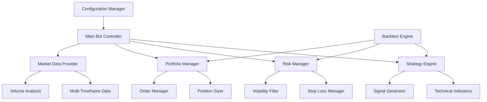

# Design Document

## Overview

The enhanced Bitcoin trading bot will be restructured into a modular architecture with separate components for risk management, technical analysis, backtesting, and configuration management. The design emphasizes separation of concerns, testability, and maintainability while preserving the existing trend reversal strategy as the core trading logic.

## Architecture

### Core Components



### Class Structure

- **TradingBot**: Main orchestrator class
- **StrategyEngine**: Implements trend reversal logic with multi-timeframe analysis
- **RiskManager**: Handles stop-loss, volatility filtering, and position limits
- **PortfolioManager**: Manages position sizing and portfolio allocation
- **MarketDataProvider**: Fetches and processes market data from multiple timeframes
- **BacktestEngine**: Simulates trading on historical data
- **ConfigurationManager**: Handles configuration loading and validation

## Components and Interfaces

### 1. Configuration Manager

```python
class ConfigurationManager:
    def load_config(self, config_path: str) -> Dict
    def validate_config(self, config: Dict) -> bool
    def get_strategy_params(self) -> StrategyConfig
    def get_risk_params(self) -> RiskConfig
    def hot_reload(self) -> bool
```

**Configuration Structure:**
- Strategy parameters (MA periods, RSI thresholds)
- Risk management settings (stop-loss %, max position size)
- API credentials and trading pairs
- Notification settings
- Backtesting parameters

### 2. Market Data Provider

```python
class MarketDataProvider:
    def get_multi_timeframe_data(self, symbol: str, timeframes: List[str]) -> Dict[str, DataFrame]
    def calculate_volatility(self, df: DataFrame) -> float
    def get_volume_profile(self, df: DataFrame) -> VolumeProfile
    def is_market_open(self) -> bool
```

**Features:**
- Fetches data from 15m, 1h, 4h timeframes
- Calculates ATR-based volatility
- Volume analysis and filtering
- Market session detection

### 3. Technical Analysis Engine

```python
class TechnicalAnalysis:
    def calculate_indicators(self, df: DataFrame) -> DataFrame
    def detect_trend_alignment(self, multi_tf_data: Dict) -> TrendAlignment
    def calculate_signal_strength(self, indicators: Dict) -> float
    def get_support_resistance(self, df: DataFrame) -> Tuple[float, float]
```

**Enhanced Indicators:**
- Multi-timeframe moving averages
- RSI with divergence detection
- ATR for volatility measurement
- Volume-weighted indicators
- Support/resistance levels

### 4. Risk Manager

```python
class RiskManager:
    def set_stop_loss(self, entry_price: float, side: str) -> float
    def update_trailing_stop(self, current_price: float, entry_price: float) -> float
    def check_volatility_filter(self, volatility: float) -> bool
    def validate_trade_conditions(self, signal: TradingSignal) -> bool
    def calculate_max_position_size(self, account_balance: float) -> float
```

**Risk Features:**
- Dynamic stop-loss with trailing functionality
- Volatility-based position sizing
- Maximum drawdown protection
- Correlation-based exposure limits

### 5. Portfolio Manager

```python
class PortfolioManager:
    def calculate_position_size(self, signal_strength: float, volatility: float) -> float
    def get_current_exposure(self) -> float
    def check_position_limits(self) -> bool
    def update_portfolio_metrics(self) -> PortfolioMetrics
```

**Position Sizing Methods:**
- Kelly Criterion implementation
- Fixed percentage of portfolio
- Volatility-adjusted sizing
- Risk parity approach

### 6. Backtest Engine

```python
class BacktestEngine:
    def run_backtest(self, start_date: str, end_date: str) -> BacktestResults
    def simulate_trade(self, signal: TradingSignal, market_data: DataFrame) -> Trade
    def calculate_performance_metrics(self, trades: List[Trade]) -> PerformanceMetrics
    def generate_report(self, results: BacktestResults) -> str
```

**Backtest Features:**
- Historical data simulation
- Realistic fee and slippage modeling
- Performance metrics calculation
- Risk-adjusted returns analysis

## Data Models

### Trading Signal
```python
@dataclass
class TradingSignal:
    timestamp: datetime
    symbol: str
    side: str  # 'BUY' or 'SELL'
    strength: float  # 0.0 to 1.0
    entry_price: float
    stop_loss: float
    take_profit: Optional[float]
    timeframe_alignment: Dict[str, bool]
    volatility_score: float
```

### Portfolio State
```python
@dataclass
class PortfolioState:
    total_balance: float
    available_balance: float
    positions: Dict[str, Position]
    unrealized_pnl: float
    daily_pnl: float
    max_drawdown: float
    win_rate: float
```

### Risk Metrics
```python
@dataclass
class RiskMetrics:
    current_volatility: float
    portfolio_var: float  # Value at Risk
    sharpe_ratio: float
    max_drawdown: float
    exposure_ratio: float
```

## Error Handling

### Retry Strategy
- Exponential backoff for API calls
- Circuit breaker pattern for persistent failures
- Graceful degradation when secondary data sources fail

### Monitoring and Alerts
- Health check endpoints for external monitoring
- Configurable alert thresholds
- Integration with notification services (email, Telegram, Discord)

### Safe Mode
- Automatic position closure during critical errors
- Emergency stop functionality
- State persistence for recovery

## Testing Strategy

### Unit Tests
- Individual component testing
- Mock external dependencies (Binance API)
- Edge case validation
- Configuration validation tests

### Integration Tests
- End-to-end trading flow testing
- API integration testing
- Database persistence testing
- Multi-timeframe data consistency

### Backtesting Validation
- Historical performance validation
- Strategy parameter optimization
- Walk-forward analysis
- Monte Carlo simulation

### Performance Tests
- Latency measurement for order execution
- Memory usage optimization
- Concurrent request handling
- Data processing efficiency

## Configuration Schema

```yaml
# config.yaml
strategy:
  name: "enhanced_trend_reversal"
  timeframes: ["15m", "1h", "4h"]
  ma_fast: 20
  ma_slow: 50
  rsi_period: 14
  rsi_overbought: 70
  rsi_oversold: 30

risk_management:
  stop_loss_percent: 0.02
  trailing_stop: true
  max_position_size: 0.1
  max_daily_loss: 0.05
  volatility_threshold: 2.0

portfolio:
  sizing_method: "kelly"  # or "fixed_percent", "volatility_adjusted"
  base_position_size: 0.001
  max_positions: 3
  correlation_limit: 0.7

backtesting:
  start_date: "2023-01-01"
  end_date: "2024-01-01"
  initial_balance: 10000
  commission: 0.001
  slippage: 0.0005

notifications:
  enabled: true
  channels: ["telegram", "email"]
  alert_levels: ["error", "trade", "daily_summary"]
```

## Performance Considerations

### Optimization Areas
- Efficient data caching for multiple timeframes
- Parallel processing for technical indicator calculations
- Memory-efficient historical data storage
- Optimized API request batching

### Scalability
- Support for multiple trading pairs
- Horizontal scaling for backtesting
- Modular architecture for easy feature addition
- Plugin system for custom indicators